# LLM CUDA Engine
## A From-Scratch CUDA Inference Runtime for LLaMA-Style Models with Paged KV Cache, INT8 Mixed Precision, and OpenAI-Compatible HTTP Serving

[]()
[]()
[]()
[]()
[]()

---

## Overview

`llm-cuda-engine-stable` is a research-oriented, systems-level implementation of a modern large language model inference stack built directly in **C++ and CUDA**, without relying on PyTorch runtime execution, TensorRT-LLM, or vLLM internals.

The project reconstructs the core serving path used by production LLM systems:

- model weight loading from custom binary formats
- GPU memory pool management
- FP16 / INT8 mixed-precision execution
- custom CUDA kernels for transformer primitives
- Paged KV-cache for autoregressive decoding
- batched token generation
- tokenizer decode and encode path
- HTTP inference server compatible with OpenAI-style chat completion requests

The implementation currently targets **TinyLlama-1.1B / LLaMA-style architectures** and has demonstrated stable single-GPU inference with practical throughput on consumer NVIDIA hardware.

---

## Motivation

Modern LLM serving systems are bottlenecked not only by compute, but also by:

- kernel launch overhead
- memory bandwidth during decode
- KV-cache fragmentation
- repeated allocation overhead
- inefficient handling of variable-length requests
- lack of low-level visibility into inference internals

This repository was built to understand and reproduce those mechanisms from first principles.

Rather than wrapping an existing framework, this engine exposes every major subsystem explicitly:

- tensor layout
- memory allocation
- quantized GEMV
- RoPE
- RMSNorm
- paged attention lookup
- token-by-token decoding loop
- REST server integration

The result is a compact but instructive inference runtime that demonstrates how production GPU-backed LLM systems operate beneath high-level APIs.

---

## Proposed Architecture
1. High-Level System Architecture
```mermaid
graph TB
    subgraph USER_LAYER["User Interface Layer"]
        CLI["CLI Interface<br/>./llm-engine --model llama-7b --prompt 'Hello'"]
        HTTP["HTTP API Server<br/>(Optional REST endpoint)"]
        STREAM["Streaming Token Output<br/>Token-by-token callback"]
    end

    subgraph HOST_LAYER["Host Layer (CPU)"]
        CONFIG["Config Parser<br/>Read model config.json<br/>n_layers, n_heads, dim, vocab_size"]
        WEIGHT_LOADER["Weight Loader<br/>Safetensors / GGUF Parser<br/>Memory-mapped file I/O"]
        TOKENIZER["BPE Tokenizer<br/>Vocabulary + Merge Rules<br/>Encode / Decode"]
        ORCHESTRATOR["Execution Orchestrator<br/>Layer-by-layer dispatch<br/>Stream management"]
        SAMPLER["Token Sampler<br/>Temperature / Top-K / Top-P<br/>Repetition penalty"]
    end

    subgraph DEVICE_LAYER["Device Layer (GPU)"]
        MEM_MGR["GPU Memory Manager<br/>Pool allocator<br/>Lifetime tracking"]
        KERNEL_LIB["CUDA Kernel Library<br/>All custom kernels"]
        ATTENTION_ENGINE["Attention Engine<br/>Naive → Flash → Paged"]
        KV_CACHE["KV-Cache Manager<br/>Pre-allocated buffers<br/>Per-layer, per-head"]
        QUANT_ENGINE["Quantization Engine<br/>INT8/INT4 dequant kernels"]
    end

    subgraph OPTIMIZATION_LAYER["Optimization Layer"]
        FUSION["Kernel Fusion Engine<br/>Combine adjacent kernels"]
        CUDA_GRAPHS["CUDA Graphs<br/>Capture & replay decode step"]
        TENSOR_PARALLEL["Tensor Parallelism<br/>Multi-GPU NCCL sharding"]
        SPEC_DECODE["Speculative Decoding<br/>Draft + Verify model"]
    end

    CLI --> ORCHESTRATOR
    HTTP --> ORCHESTRATOR
    ORCHESTRATOR --> STREAM

    CONFIG --> ORCHESTRATOR
    WEIGHT_LOADER -->|"Copy weights<br/>to GPU"| MEM_MGR
    TOKENIZER -->|"token_ids[]"| ORCHESTRATOR
    ORCHESTRATOR -->|"Launch kernels"| KERNEL_LIB
    ORCHESTRATOR -->|"Manage attention"| ATTENTION_ENGINE
    ORCHESTRATOR -->|"Manage cache"| KV_CACHE
    ORCHESTRATOR -->|"Get logits"| SAMPLER
    SAMPLER -->|"next_token_id"| TOKENIZER

    KERNEL_LIB --> MEM_MGR
    ATTENTION_ENGINE --> KV_CACHE
    QUANT_ENGINE --> KERNEL_LIB

    FUSION --> KERNEL_LIB
    CUDA_GRAPHS --> ORCHESTRATOR
    TENSOR_PARALLEL --> MEM_MGR
    SPEC_DECODE --> ORCHESTRATOR

    style USER_LAYER fill:#1a1a2e,stroke:#e94560,stroke-width:2px,color:#fff
    style HOST_LAYER fill:#16213e,stroke:#0f3460,stroke-width:2px,color:#fff
    style DEVICE_LAYER fill:#0f3460,stroke:#e94560,stroke-width:2px,color:#fff
    style OPTIMIZATION_LAYER fill:#533483,stroke:#e94560,stroke-width:2px,color:#fff

```
2. Complete LLaMA Transformer Architecture (Single Forward Pass)
```mermaid
graph TB
    INPUT["Input Token IDs<br/>[batch_size × seq_len]"] --> EMB["Embedding Lookup Kernel<br/>token_id → vector<br/>[batch × seq × dim]"]

    EMB --> LAYER_LOOP

    subgraph LAYER_LOOP[" Repeat × N_LAYERS (e.g., 32 for LLaMA-7B)"]

        subgraph ATTN_BLOCK["Self-Attention Block"]
            RN1["RMSNorm Kernel<br/>Normalize hidden state"]
            QKV_PROJ["Q/K/V Linear Projections<br/>3× GEMM Kernels<br/>W_q, W_k, W_v"]
            ROPE["RoPE Kernel<br/>Apply rotary embeddings<br/>to Q and K"]
            KV_STORE["KV-Cache Write<br/>Store K,V for this layer"]
            KV_READ["KV-Cache Read<br/>Concat with past K,V"]
            RESHAPE["Reshape to Multi-Head<br/>[batch × n_heads × seq × head_dim]"]
            SCORE["Attention Score<br/>QK^T / √d_k<br/>Batched GEMM"]
            MASK["Causal Mask Apply<br/>Upper triangle = -inf"]
            SOFT["Softmax Kernel<br/>Row-wise softmax"]
            ATTN_OUT["Attention × V<br/>Batched GEMM"]
            CONCAT["Concat Heads<br/>[batch × seq × dim]"]
            O_PROJ["Output Projection<br/>GEMM with W_o"]
        end

        RES1["Residual Add Kernel<br/>x = x + attn_output"]

        subgraph FFN_BLOCK["Feed-Forward Block (SwiGLU)"]
            RN2["RMSNorm Kernel<br/>Normalize hidden state"]
            GATE["Gate Projection<br/>GEMM with W_gate"]
            UP["Up Projection<br/>GEMM with W_up"]
            SILU["SiLU Activation Kernel<br/>x * sigmoid(x)"]
            MUL["Element-wise Multiply<br/>SiLU(gate) ⊙ up"]
            DOWN["Down Projection<br/>GEMM with W_down"]
        end

        RES2["Residual Add Kernel<br/>x = x + ffn_output"]
    end

    LAYER_LOOP --> FINAL_NORM["Final RMSNorm Kernel"]
    FINAL_NORM --> LM_HEAD["LM Head GEMM<br/>Project to vocab_size<br/>[batch × seq × vocab_size]"]
    LM_HEAD --> LOGITS["Raw Logits"]
    LOGITS --> SAMPLE["Sampling Kernel<br/>Temperature → Top-K → Top-P"]
    SAMPLE --> NEXT_TOKEN["Next Token ID"]

    %% Connections within attention block
    RN1 --> QKV_PROJ
    QKV_PROJ --> ROPE
    ROPE --> KV_STORE
    KV_STORE --> KV_READ
    KV_READ --> RESHAPE
    RESHAPE --> SCORE
    SCORE --> MASK
    MASK --> SOFT
    SOFT --> ATTN_OUT
    ATTN_OUT --> CONCAT
    CONCAT --> O_PROJ
    O_PROJ --> RES1

    %% Connections within FFN block
    RES1 --> RN2
    RN2 --> GATE
    RN2 --> UP
    GATE --> SILU
    SILU --> MUL
    UP --> MUL
    MUL --> DOWN
    DOWN --> RES2

    style ATTN_BLOCK fill:#1a1a2e,stroke:#e94560,stroke-width:2px,color:#fff
    style FFN_BLOCK fill:#16213e,stroke:#0f3460,stroke-width:2px,color:#fff
    style LAYER_LOOP fill:#0d1117,stroke:#e94560,stroke-width:3px,color:#fff
```
3. CUDA Kernel Hierarchy & Dependencies
```mermaid
graph TB
    subgraph LEVEL_0["Level 0: Hardware Primitives"]
        WARP_RED["Warp Reduce<br/>__shfl_down_sync"]
        BLOCK_RED["Block Reduce<br/>Shared memory reduction"]
        LDST["Vectorized Load/Store<br/>float4, int4 coalescing"]
        SMEM["Shared Memory Tiling<br/>Bank-conflict-free layout"]
    end

    subgraph LEVEL_1["Level 1: Basic Kernels"]
        GEMM_NAIVE["GEMM Naive<br/>One thread per output element<br/>~50 GFLOPS"]
        GEMM_TILED["GEMM Tiled<br/>Shared memory tiles<br/>~500 GFLOPS"]
        GEMM_WMMA["GEMM Tensor Core<br/>wmma::mma_sync<br/>~120 TFLOPS (FP16)"]
        ELEM_ADD["Element-wise Add<br/>Residual connections"]
        ELEM_MUL["Element-wise Multiply<br/>SwiGLU gate"]
        SILU_K["SiLU Kernel<br/>x * sigmoid(x)"]
        COPY_K["Memory Copy Kernel<br/>Async memcpy_async"]
    end

    subgraph LEVEL_2["Level 2: Compound Kernels"]
        RMSNORM["RMSNorm<br/>Reduce → rsqrt → scale<br/>Fused single kernel"]
        SOFTMAX_K["Online Softmax<br/>3-pass: max → sum → normalize<br/>Numerically stable"]
        ROPE_K["RoPE Kernel<br/>Sinusoidal rotation<br/>Paired dimension rotation"]
        EMB_K["Embedding Lookup<br/>Gather from weight table"]
        CAUSAL_MASK_K["Causal Mask<br/>Triangular masking"]
    end

    subgraph LEVEL_3["Level 3: Attention Variants"]
        NAIVE_ATTN["Naive Attention<br/>Materialize full QK^T matrix<br/>O(n²) memory"]
        FLASH_ATTN["Flash Attention v2<br/>Tiled, online softmax<br/>O(n) memory, no materialization"]
        PAGED_ATTN["Paged Attention<br/>Non-contiguous KV blocks<br/>Virtual memory style"]
        GQA_ATTN["Grouped Query Attention<br/>K,V head broadcasting<br/>Shared across Q heads"]
    end

    subgraph LEVEL_4["Level 4: Fused Kernels"]
        FUSED_QKV["Fused QKV Projection<br/>Single GEMM, 3× output split"]
        FUSED_NORM_GEMM["Fused RMSNorm + GEMM<br/>Normalize and project in 1 kernel"]
        FUSED_GATE["Fused SwiGLU<br/>Gate + SiLU + Multiply in 1 kernel"]
        FUSED_ADD_NORM["Fused ResidualAdd + RMSNorm<br/>Add then normalize"]
        FUSED_ROPE_ATTN["Fused RoPE + Attention Score<br/>Rotate then dot-product"]
    end

    subgraph LEVEL_5["Level 5: Quantization Kernels"]
        DEQUANT_INT8["INT8 Dequantize<br/>Per-channel scale + zero-point"]
        DEQUANT_INT4["INT4 Dequantize<br/>Group-wise dequant (g=128)"]
        GEMM_INT8["INT8 GEMM<br/>dp4a instruction"]
        GEMM_INT4["INT4 GEMM<br/>Bit manipulation + accumulate"]
        QUANT_ATTN["Quantized KV-Cache<br/>FP16→INT8 K,V storage"]
    end

    %% Dependencies
    WARP_RED --> BLOCK_RED
    BLOCK_RED --> RMSNORM
    BLOCK_RED --> SOFTMAX_K
    SMEM --> GEMM_TILED
    LDST --> GEMM_NAIVE
    LDST --> ELEM_ADD
    LDST --> ELEM_MUL

    GEMM_TILED --> GEMM_WMMA
    GEMM_WMMA --> NAIVE_ATTN
    RMSNORM --> FUSED_NORM_GEMM
    SOFTMAX_K --> NAIVE_ATTN
    SOFTMAX_K --> FLASH_ATTN
    ROPE_K --> FUSED_ROPE_ATTN
    CAUSAL_MASK_K --> NAIVE_ATTN

    NAIVE_ATTN --> FLASH_ATTN
    FLASH_ATTN --> PAGED_ATTN
    FLASH_ATTN --> GQA_ATTN

    GEMM_WMMA --> FUSED_QKV
    RMSNORM --> FUSED_ADD_NORM
    SILU_K --> FUSED_GATE
    ELEM_MUL --> FUSED_GATE

    GEMM_WMMA --> GEMM_INT8
    GEMM_INT8 --> GEMM_INT4
    DEQUANT_INT8 --> GEMM_INT8
    DEQUANT_INT4 --> GEMM_INT4

    style LEVEL_0 fill:#0d1117,stroke:#58a6ff,stroke-width:2px,color:#fff
    style LEVEL_1 fill:#161b22,stroke:#58a6ff,stroke-width:2px,color:#fff
    style LEVEL_2 fill:#1a1a2e,stroke:#e94560,stroke-width:2px,color:#fff
    style LEVEL_3 fill:#16213e,stroke:#e94560,stroke-width:2px,color:#fff
    style LEVEL_4 fill:#533483,stroke:#e94560,stroke-width:2px,color:#fff
    style LEVEL_5 fill:#2d1b69,stroke:#e94560,stroke-width:2px,color:#fff
```
4. GPU Memory Layout & Management
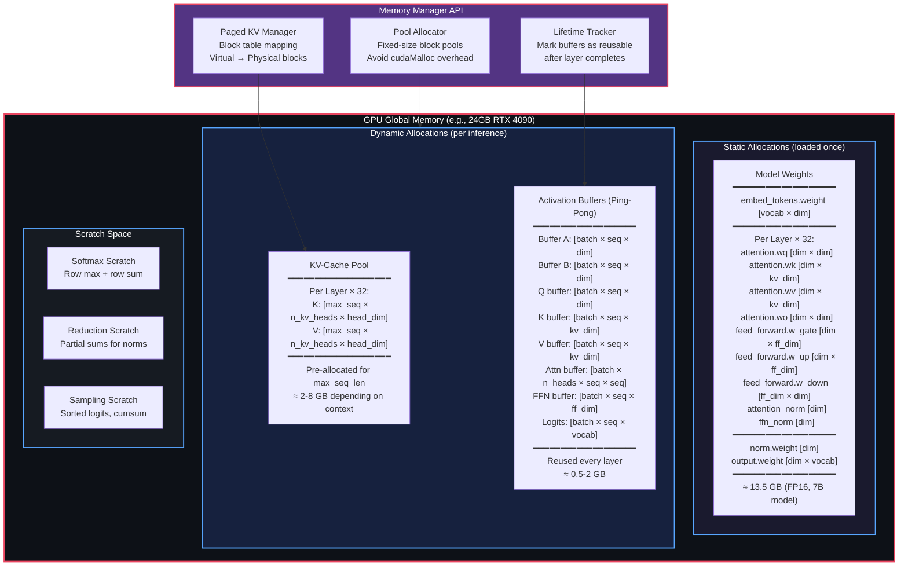
5. Inference Execution Pipeline (Prefill vs Decode)
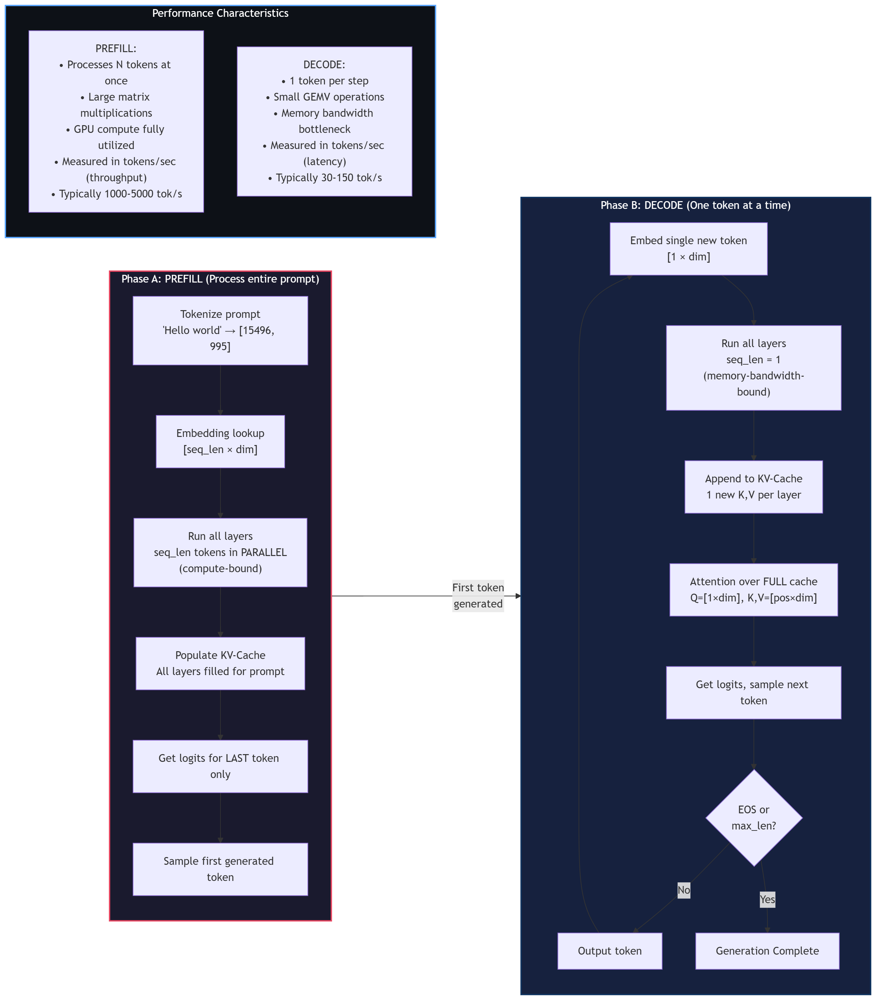
```mermaid

```
6. KV-Cache Architecture Detail
```mermaid
graph TB
    subgraph NAIVE_KV["V1: Naive KV-Cache (Phase 3)"]
        direction TB
        NK1["Pre-allocate contiguous buffers<br/>Per layer: K[max_seq, n_kv_heads, head_dim]<br/>Per layer: V[max_seq, n_kv_heads, head_dim]"]
        NK2["Position counter per sequence"]
        NK3["Write: cache[pos] = new_kv"]
        NK4["Read: slice cache[0:pos+1]"]
        NK5["Problem: Wastes memory for short sequences<br/>Problem: Fixed max_seq_len<br/>Problem: Cannot batch different lengths"]

        NK1 --> NK2 --> NK3 --> NK4 --> NK5
    end

    subgraph PAGED_KV["V2: Paged KV-Cache (Phase 5)"]
        direction TB

        subgraph BLOCK_TABLE["Block Table (per sequence)"]
            BT["Sequence 0: [Block 4, Block 7, Block 2, Block 9]<br/>Sequence 1: [Block 1, Block 5, Block 11, ...]<br/>Sequence 2: [Block 0, Block 3, ...]"]
        end

        subgraph PHYSICAL_BLOCKS["Physical Block Pool (GPU Memory)"]
            PB0["Block 0<br/>16 tokens<br/>K,V data"]
            PB1["Block 1<br/>16 tokens<br/>K,V data"]
            PB2["Block 2<br/>16 tokens<br/>K,V data"]
            PB3["Block 3<br/>16 tokens<br/>K,V data"]
            PB4["Block 4<br/>16 tokens<br/>K,V data"]
            PBDOT["..."]
            PB11["Block N<br/>16 tokens<br/>K,V data"]
            FREE["Free Block List<br/>[6, 8, 10, 12, 13...]"]
        end

        PK1[" No memory waste (allocate on demand)<br/> Different sequences can have different lengths<br/> Copy-on-write for beam search<br/> Enables continuous batching"]
    end

    subgraph QUANT_KV["V3: Quantized KV-Cache (Phase 4)"]
        QK1["Store K,V in INT8 instead of FP16<br/>2× more context in same memory"]
        QK2["Per-token scale factor stored alongside"]
        QK3["Dequantize on-the-fly during attention"]
    end

    NAIVE_KV -->|"Optimize"| PAGED_KV
    PAGED_KV -->|"Compress"| QUANT_KV

    style NAIVE_KV fill:#1a1a2e,stroke:#e94560,stroke-width:2px,color:#fff
    style PAGED_KV fill:#16213e,stroke:#58a6ff,stroke-width:2px,color:#fff
    style QUANT_KV fill:#533483,stroke:#e94560,stroke-width:2px,color:#fff
```
7. Optimization Progression & Benchmarking
. Flash Attention v2 — Internal Architecture
```mermaid
graph TB
    subgraph OPT_PROGRESSION["Optimization Progression (Expected tok/s on RTX 4090, LLaMA-7B)"]
        direction LR

        V1["V1: Naive<br/>━━━━━━━<br/>Naive GEMM<br/>Naive Attention<br/>FP32<br/>━━━━━━━<br/>~5 tok/s<br/>decode"]

        V2["V2: Tiled GEMM<br/>━━━━━━━<br/>Shared memory tiling<br/>Coalesced access<br/>FP32<br/>━━━━━━━<br/>~15 tok/s"]

        V3["V3: FP16 + TensorCores<br/>━━━━━━━<br/>WMMA intrinsics<br/>half precision<br/>2× bandwidth<br/>━━━━━━━<br/>~40 tok/s"]

        V4["V4: Flash Attention<br/>━━━━━━━<br/>Tiled attention<br/>No O(n²) memory<br/>Online softmax<br/>━━━━━━━<br/>~55 tok/s"]

        V5["V5: Kernel Fusion<br/>━━━━━━━<br/>Fused RMSNorm+GEMM<br/>Fused SwiGLU<br/>Fused ResAdd+Norm<br/>━━━━━━━<br/>~70 tok/s"]

        V6["V6: INT8 Quant<br/>━━━━━━━<br/>Weight-only INT8<br/>2× less memory<br/>Faster GEMV<br/>━━━━━━━<br/>~100 tok/s"]

        V7["V7: INT4 Quant<br/>━━━━━━━<br/>GPTQ / AWQ<br/>4× less memory<br/>━━━━━━━<br/>~130 tok/s"]

        V8["V8: CUDA Graphs<br/>━━━━━━━<br/>Capture decode step<br/>Eliminate launch overhead<br/>━━━━━━━<br/>~145 tok/s"]

        V1 -->|"3×"| V2 -->|"2.7×"| V3 -->|"1.4×"| V4 -->|"1.3×"| V5 -->|"1.4×"| V6 -->|"1.3×"| V7 -->|"1.1×"| V8
    end

    subgraph COMPARISON["Final Comparison Target"]
        OURS["Our Engine<br/>~145 tok/s"]
        LLAMA_CPP["llama.cpp<br/>~130 tok/s<br/>(Q4_K_M)"]
        VLLM["vLLM<br/>~150 tok/s<br/>(single user)"]
        TGI["TGI<br/>~140 tok/s"]

        OURS -.- LLAMA_CPP
        OURS -.- VLLM
        OURS -.- TGI
    end

    style OPT_PROGRESSION fill:#0d1117,stroke:#e94560,stroke-width:3px,color:#fff
    style COMPARISON fill:#16213e,stroke:#58a6ff,stroke-width:2px,color:#fff
```
8.  Data Flow Through Single Decode Step
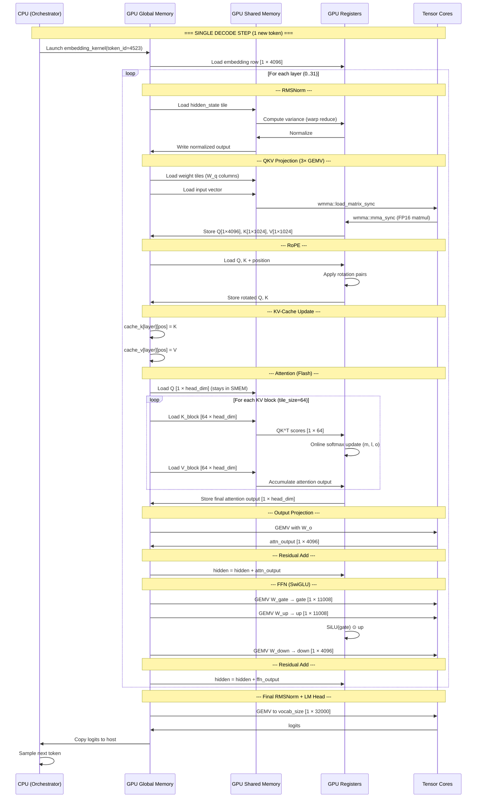
9. Flash Attention v2 — Internal Architecture
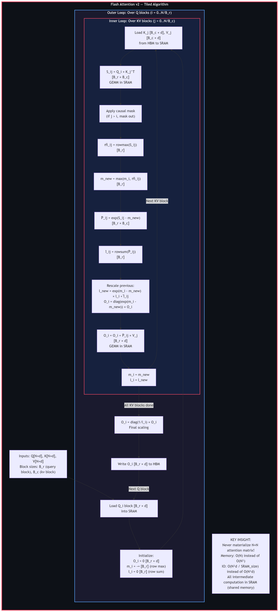
10. Multi-GPU Tensor Parallelism Architecture
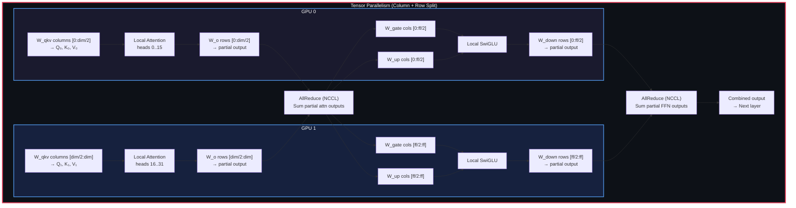
11. Benchmarking Dashboard Architecture
```mermaid
graph TB
    subgraph BENCH_SYSTEM["Benchmarking & Profiling System"]

        subgraph METRICS["Metrics Collection"]
            M1["Tokens/Second (decode)"]
            M2["Tokens/Second (prefill)"]
            M3["Time-to-First-Token (TTFT)"]
            M4["GPU Memory Usage (peak)"]
            M5["Kernel Execution Time (per kernel)"]
            M6["GPU Utilization %"]
            M7["Memory Bandwidth Utilization %"]
            M8["Arithmetic Intensity (FLOP/byte)"]
        end

        subgraph CONFIGS["Test Configurations"]
            C1["Model: LLaMA-7B, 13B, 70B"]
            C2["Precision: FP32, FP16, INT8, INT4"]
            C3["Batch size: 1, 4, 16, 64"]
            C4["Seq lengths: 128, 512, 2048, 8192"]
            C5["GPU: RTX 4090 / A100 / H100"]
        end

        subgraph COMPARISON_TARGETS["Comparison Targets"]
            CT1["Our Engine (each optimization stage)"]
            CT2["llama.cpp (Q4_K_M, Q8_0, F16)"]
            CT3["vLLM (FP16, AWQ)"]
            CT4["HuggingFace Transformers (baseline)"]
            CT5["TensorRT-LLM (upper bound)"]
        end

        subgraph OUTPUT["Output Artifacts"]
            O1["Optimization Progression Chart<br/>(tok/s vs optimization stage)"]
            O2["Comparison Bar Charts<br/>(our engine vs competitors)"]
            O3["Roofline Model Plot<br/>(arithmetic intensity vs perf)"]
            O4["Kernel Breakdown Table<br/>(% time per kernel type)"]
            O5["Nsight Compute Reports<br/>(occupancy, cache hits, stalls)"]
        end

        METRICS --> OUTPUT
        CONFIGS --> OUTPUT
        COMPARISON_TARGETS --> OUTPUT
    end

    style BENCH_SYSTEM fill:#0d1117,stroke:#e94560,stroke-width:3px,color:#fff
    style METRICS fill:#1a1a2e,stroke:#58a6ff,stroke-width:2px,color:#fff
    style CONFIGS fill:#16213e,stroke:#58a6ff,stroke-width:2px,color:#fff
    style COMPARISON_TARGETS fill:#533483,stroke:#e94560,stroke-width:2px,color:#fff
    style OUTPUT fill:#0d4b1c,stroke:#2ea043,stroke-width:2px,color:#fff
```


## Highlights

### Implemented
- Custom GPU memory pool allocator
- FP16 tensor storage
- INT8 per-row quantized MLP weights
- FP16 + INT8 mixed precision decode path
- RMSNorm kernel
- SwiGLU kernel
- RoPE kernel
- embedding lookup kernel
- paged KV-cache block storage
- batched paged attention score kernel
- batched paged attention reduction kernel
- batched autoregressive generation loop
- OpenAI-compatible HTTP API endpoint
- decode path integrated with tokenizer encode/decode
- TinyLlama custom binary export pipeline

### Demonstrated
- Stable end-to-end text generation
- OpenAI-style `POST /v1/chat/completions`
- arbitrary prompt ingestion through tokenizer encode path
- GPU-backed inference server running locally
- throughput in the range of ~50–70 tok/s in current stable path
- historical benchmark milestones up to ~131 tok/s in prior phase branches

---

## System Architecture

The system is divided into four major layers:

### 1. Serving Layer
Responsible for:
- HTTP request parsing
- JSON serialization
- prompt ingestion
- generation configuration
- user-facing response formatting

### 2. Orchestration Layer
Responsible for:
- tokenizer encode/decode
- batch formation
- sequence lifecycle management
- per-step decode scheduling
- block table construction
- prompt prefill / decode control

### 3. Memory Layer
Responsible for:
- GPU arena allocation
- persistent model weights
- scratch activation buffers
- paged KV-cache block allocation
- logical-to-physical block mapping

### 4. Compute Layer
Responsible for:
- linear projections
- normalization
- RoPE
- attention score computation
- softmax
- weighted value accumulation
- quantized feed-forward path
- final LM head projection

---

## End-to-End Inference Flow

A single request follows this path:

1. HTTP server receives JSON request
2. prompt text is extracted
3. tokenizer encodes prompt into token IDs
4. tokens are wrapped into batch format
5. decode loop begins
6. current token is embedded on GPU
7. each transformer layer:
   - RMSNorm
   - Q/K/V projection
   - RoPE
   - paged KV write
   - paged attention score computation
   - softmax
   - weighted sum over V cache
   - output projection
   - residual add + RMSNorm
   - INT8 MLP
   - residual add
8. final RMSNorm + LM head projection
9. logits copied or reduced for next-token choice
10. token decoded back into string
11. response returned through JSON API

---
## Experimental Evidence

### OpenAI-Compatible HTTP Serving with GPU Inference
The engine exposes a REST interface compatible with the `chat/completions` style API. Requests are accepted through the HTTP layer, tokenized in C++, executed through the CUDA inference runtime, and returned as structured JSON responses.

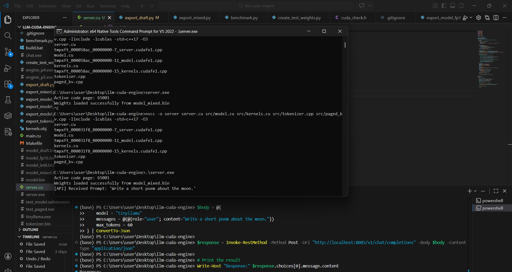

This validates the complete serving stack:
- HTTP request parsing
- JSON prompt extraction
- tokenizer encode path
- paged KV-cache allocation
- GPU-backed autoregressive generation
- JSON response serialization

### CUDA Graph Decode Execution
A graph-captured decode path was brought up to reduce kernel launch overhead and improve single-request token latency.

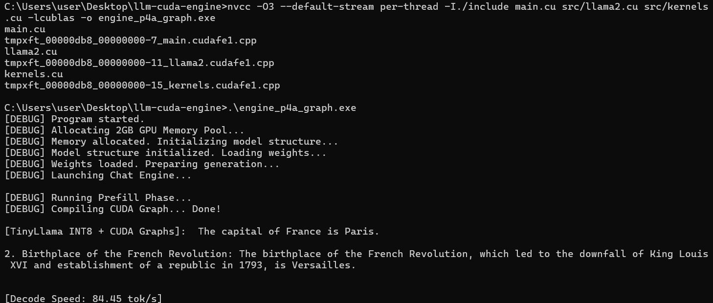

This benchmark demonstrates:
- stable CUDA graph compilation
- successful decode replay
- integrated TinyLlama INT8 inference
- measured decode throughput in the ~84 tok/s range

### FlashAttention and Prefill/Decode Behavior
The optimized inference path exhibits the expected separation between prompt prefill and autoregressive decode phases, matching the behavior of modern LLM serving systems.

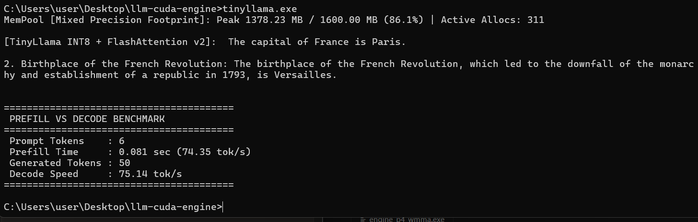

This validates:
- distinct prefill throughput behavior
- lower-latency token-by-token decode behavior
- stable mixed-precision generation
- end-to-end correctness under optimized attention flow

---

## Benchmark Snapshots

### Kernel and GEMM Bring-Up
Early benchmarking established baseline performance for elementwise operations, transpose kernels, custom GEMM implementations, and cuBLAS comparisons.

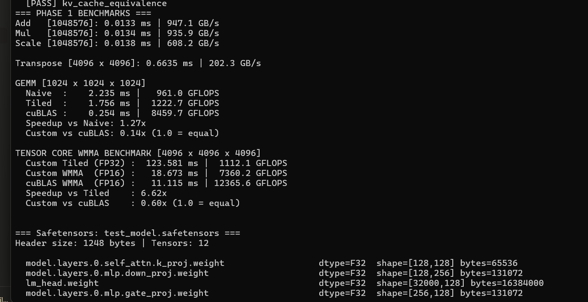

These results were used to validate:
- memory bandwidth utilization on simple kernels
- naive vs tiled GEMM speedups
- tensor core WMMA progress
- distance from cuBLAS ceilings

### Benchmark Progression Philosophy
The system was optimized incrementally:
- establish correctness
- benchmark primitive kernels
- compare against cuBLAS
- introduce tensor cores
- split prefill vs decode
- add quantization
- integrate paged attention
- expose server-facing inference

This workflow mirrors practical systems research:
- measure
- profile
- isolate bottlenecks
- optimize the critical path
- re-measure

---

## Serving Demo

### End-to-End REST Inference
The engine supports interactive request/response serving over HTTP using an OpenAI-style schema.


A typical serving cycle includes:
1. receive user prompt through HTTP POST
2. parse JSON request body
3. encode text prompt to token IDs
4. dispatch to CUDA inference engine
5. generate tokens using paged KV-cache
6. decode token IDs back to text
7. return structured JSON response

This demonstrates that the project is not only a kernel collection, but a complete inference runtime.

### Decode Throughput in Server Mode
The serving path also provides practical throughput metrics during real API-driven inference, showing that the architecture remains functional beyond synthetic benchmarks.

Observed behavior includes:
- stable request handling
- successful model load from custom binary format
- practical token generation speed
- correct output flow through server and client

---

## Profiling and Validation

### Early Profiling Summary
The project includes kernel-level profiling summaries and memory-pool instrumentation used during foundation phases.


This stage validated:
- memory pool correctness
- active allocation tracking
- persistent vs scratch memory behavior
- benchmark instrumentation plumbing
- profiling output for later optimization work

### Validation Strategy
The implementation was validated in layers:

- kernel correctness
- memory allocator correctness
- tensor shape consistency
- weight loading integrity
- tokenizer decoding cleanup
- prompt-to-generation end-to-end behavior
- HTTP response correctness

### Performance Validation
The benchmark and profiling snapshots collectively show:
- custom kernel bring-up
- progression toward high-throughput inference
- stable decode execution under optimized settings
- successful integration of CUDA graphs and paged attention paths

### Systems-Level Validation
These artifacts demonstrate that the engine is not just theoretically implemented, but experimentally exercised across:
- local CLI generation
- benchmark executables
- profiling summaries
- graph-captured decode
- HTTP server deployment
- real prompt/response inference

## Repository Structure

```text
llm-cuda-engine/
├── include/
│   ├── model.h
│   ├── tensor.h
│   ├── tokenizer.h
│   ├── paged_kv.h
│   ├── memory_pool.h
│   ├── kernels.cuh
│   ├── httplib.h
│   └── json.hpp
├── src/
│   ├── model.cu
│   ├── kernels.cu
│   ├── tokenizer.cpp
│   └── paged_kv.cpp
├── server.cu
├── main.cu
├── export_mixed.py
├── export_draft.py
├── export_model.py
├── export_model_fp16.py
├── export_model_int8.py
├── export_tokenizer.py
├── benchmark.py
├── model_mixed.bin
├── tokenizer.bin
└── README.md
```
## Core Design Components
### GPU Memory Pool
The engine avoids repeated **cudaMalloc / cudaFree**  during inference by using a simple bump allocator.

Two pools are typically used:

- model pool for long-lived allocations like weights and KV block pools
- scratch pool for per-request activations, logits, temporary attention buffers

This reduces CPU overhead and makes allocation behavior deterministic.

### Why it matters
Autoregressive decoding is latency-sensitive. Repeated dynamic allocations are expensive and fragment device memory. Pre-allocation ensures predictable runtime behavior.

## Tensor Representation
Three main tensor wrappers are used:

- **Tensor** for FP32 temporary buffers
- **HalfTensor** for FP16 activations and weights
- **QuantizedTensor** for INT8 row-quantized matrices with per-row scales

These wrappers are intentionally minimal. They do not own device lifetimes independently; instead, they allocate from the memory pool.

This design mirrors inference engines where allocator policy is centralized.

## Paged KV Cache
The KV cache is implemented using fixed-size physical blocks.

Each active sequence stores:

- current length
- list of assigned physical block IDs
The manager supports:

- allocate sequence
- append token
- free sequence
This design avoids monolithic contiguous KV buffers and is a simplified version of the PagedAttention memory abstraction.

### Benefits
- reduced memory fragmentation
- efficient reuse of freed blocks
- support for variable-length sequences
- foundation for continuous batching

## Attention Implementation

The attention path uses paged K/V lookup instead of contiguous cache traversal.

For each token:

- current Q is computed
- K and V are written into paged block memory
- scores are computed across all cached positions using block table resolution
- softmax is applied
- weighted value sum is accumulated

### Current structure
- score kernel resolves physical KV blocks from logical token positions
- sum kernel gathers V vectors from paged storage
- softmax is per-head and per-row

This is not yet a fully tiled FlashAttention implementation, but it reproduces the paged serving abstraction required for modern LLM serving.

## RoPE
Rotary positional embeddings are applied during decode for both **Q** and **K**.

The implementation includes:

- batched RoPE for decode path
- standard angle calculation using 10000^(-2i/d)
- half-precision in-place updates
This aligns with LLaMA-style rotary attention.

## RMSNorm and Residual Fusion
The implementation includes:

- standard RMSNorm
- fused residual-add + RMSNorm variant
This reduces memory traffic by combining:

- residual writeback
- normalization scale computation
- output transformation

Kernel fusion is critical in decode workloads because arithmetic is cheap compared to memory movement.

## INT8 Mixed Precision Feed-Forward
The MLP path uses:

- FP16 activations
- INT8 weights
- FP16 per-row scales
- custom GEMV dequantization kernel
The design is:

- input stays in FP16
- weight row is read as INT8
- scale is applied on-the-fly
- result accumulated in FP32 and stored as FP16
This is particularly effective in decode, where matrix-vector multiplication dominates.

### Why only MLP is quantized here
The current stable path leaves attention projections in FP16 while quantizing the heavier feed-forward layers. This balances simplicity, stability, and speed.

## Tokenizer
The tokenizer currently supports:

- loading exported token vocabulary from tokenizer.bin
- decoding output token IDs into readable text
- encoding raw user prompts into token IDs using a greedy vocabulary-matching path

It includes cleanup logic for:
- SentencePiece space marker
- newline tokens
- apostrophe and UTF-8 output normalization

This enables arbitrary prompt input over HTTP instead of only hardcoded demo prompts.

## HTTP API Server
The server uses:

- cpp-httplib
- nlohmann::json

It exposes:

- GET /health
- POST /v1/chat/completions
The chat completions endpoint accepts payloads in an OpenAI-like format:
```JSON

{
  "model": "tinyllama",
  "messages": [
    {"role": "user", "content": "Write a short poem about the moon."}
  ],
  "max_tokens": 60,
  "temperature": 1.0,
  "repetition_penalty": 1.1
}
```
And returns:

- generated text
- metadata
- backend token/s metrics
This allows the engine to be used with tooling that expects familiar chat completion schemas.

## Model Export Pipeline
The repository includes Python scripts for exporting weights from HuggingFace checkpoints into custom binary files.

Export process
1. load TinyLlama model from Transformers
2. extract state dict
3. write token embeddings in FP16
4. write attention projections in FP16
5. quantize MLP weights to INT8 with per-row scales
6. write final norm and LM head
7. export tokenizer vocabulary
This ensures the binary layout matches the C++ loader exactly.

### Important consistency requirement
The exported model format must match:

- layer count
- hidden size
- number of heads
- kv heads
- MLP quantization layout
Much of the early debugging in this project came from mismatches between export assumptions and C++ loader expectations.

## Example Build Instructions
Windows + NVCC

```Bash

nvcc -o server server.cu src/model.cu src/kernels.cu src/tokenizer.cpp src/paged_kv.cpp -Iinclude -lcublas -std=c++17 -O3
```
Run:

```Bash

.\server.exe
Expected startup:
```
```text

Active code page: 65001
Initializing GPU Memory Pools...
Loading LLaMA Engine (INT8/FP16)...
Tokenizer loaded 32000 tokens.
Weights loaded successfully from model_mixed.bin
================================================
LLM Inference Server Running on Port 8085
================================================
``` 

## Example API Usage
### PowerShell
```PowerShell

$body = @{
    model = "tinyllama"
    messages = @(@{role="user"; content="Write a short poem about the moon."})
    max_tokens = 60
} | ConvertTo-Json -Depth 5

$response = Invoke-RestMethod -Method Post -Uri "http://localhost:8085/v1/chat/completions" -Body $body -ContentType "application/json"

Write-Host "Generated Text:" $response.choices[0].message.content
Write-Host "Speed:" $response.backend_stats.tokens_per_sec "tok/s"
```
### cURL
``` Bash

curl -X POST http://localhost:8085/v1/chat/completions \
  -H "Content-Type: application/json" \
  -d "{\"model\":\"tinyllama\",\"messages\":[{\"role\":\"user\",\"content\":\"Write a short poem about the moon.\"}],\"max_tokens\":60}"
  ```
## Current Capabilities
### Supported
- TinyLlama / LLaMA-style architecture
- single-GPU inference
- FP16 weights for attention path
- INT8 MLP weights
- paged KV caching
- HTTP request/response serving
- arbitrary prompt encoding
- batch-based decode loop
### Not yet fully generalized
- beam search
- top-k / top-p sampling on GPU
- speculative decoding
- multi-GPU tensor parallelism
- true continuous dynamic batching in server loop
- full SentencePiece merge-rank faithful tokenizer
- FlashAttention v2 style tiled attention in stable branch
- CUDA graphs in current integrated server branch

## Performance Notes
The observed throughput in the current stable serving path is typically:

- **~38 tok/s to ~70 tok/s** depending on prompt, batch shape, and server path
Historical prior branches demonstrated:

- **~84 tok/s** with CUDA graphs + INT8
- **~131 tok/s** with paged attention + continuous batching
These numbers are sensitive to:

- GPU model
- Windows vs Linux driver overhead
- batch size
- prompt length
- current decode kernel path
- logits copy/sampling strategy
The current branch prioritizes correctness and full-stack integration over maximal benchmark tuning.

## Research Relevance
This repository is useful as a compact educational artifact for understanding the internals of modern inference engines such as:

- vLLM
- TensorRT-LLM
- llama.cpp GPU backends
- custom inference stacks used in production serving systems
It illustrates several research and systems ideas in concrete form:

1. IO-awareness matters more than FLOPs in decode
Autoregressive inference is dominated by memory movement, not raw compute.

2. KV-cache virtualization is essential
Paged memory layouts allow practical serving under variable-length workloads.

3. Mixed precision is mandatory
Quantization is not optional for real deployment; it is a systems requirement.

4. Framework-free inference is tractable
One can build a functioning LLM server using only:

- CUDA
- cuBLAS
- a tokenizer
- an HTTP layer
- careful memory management
## Lessons Learned

During development, several practical issues emerged:

### Export/runtime mismatches are catastrophic
If Python exports FP16 but the C++ loader expects INT8, outputs become pure garbage even though the code “runs.”

### Tokenization quality determines perceived model quality
Incorrect prompt encoding can make a correct runtime appear broken.

### Serving bugs often masquerade as model bugs
Many “bad output” issues originated not in kernels, but in:

- tokenizer path
- weight layout
- block table population
- hidden file/include path errors on Windows
Infrastructure matters
A large share of effort went into:

- file layout
- include paths
- build stability
- UTF-8 console behavior
- API compatibility
- custom binary formats
This mirrors real-world ML systems engineering.

## Example Output
Prompt
**France**

Example Generation
```text

Paris, which is the most famous for its art and culture.
The Eiffy a city of Paris, France's capital of the world-France's most famous French...
```
Prompt
**Write a short poem about the moon.**

### Behavior
The engine accepts the arbitrary prompt through the tokenizer encode path and generates a continuation through the same CUDA inference stack.

The factual and linguistic quality is limited primarily by:

- TinyLlama model size
- simple greedy decoding
- lightweight quantization
not by the serving stack itself.

## Future Work
### Short-term
- top-k / top-p sampling kernel integration
- GPU argmax/sampling to avoid host logits copy
- better tokenizer encode fidelity
- server-side dynamic request queue
### Medium-term
- CUDA graph capture for decode loop
- fused decode kernels
- INT4 group-wise quantization
- improved prefill path
- streaming token responses over HTTP
### Long-term
- multi-GPU tensor parallel inference
- speculative decoding with draft model
- true continuous batching
- benchmark suite against vLLM / llama.cpp / TGI
- support for larger LLaMA-family checkpoints

## Intended Audience
This repository is designed for:

- systems engineers
- CUDA programmers
- LLM infrastructure researchers
- students studying inference optimization
- engineers who want to understand how production LLM serving actually works under the hood
It is not intended to compete directly with mature serving stacks, but to expose their internal mechanisms clearly and concretely.

## Acknowledgements
This work is inspired by the ideas behind:

- LLaMA and LLaMA-style transformer inference
- FlashAttention
- vLLM and PagedAttention
- mixed precision and quantized inference literature
- systems work in production ML serving

## Final Note
This repository represents a full-stack reconstruction of a modern LLM inference runtime:
from tokenizer and binary weight export,
through paged GPU memory management and quantized CUDA kernels,
all the way to an HTTP API endpoint serving real text generations.

It is both a systems project and a learning artifact.
